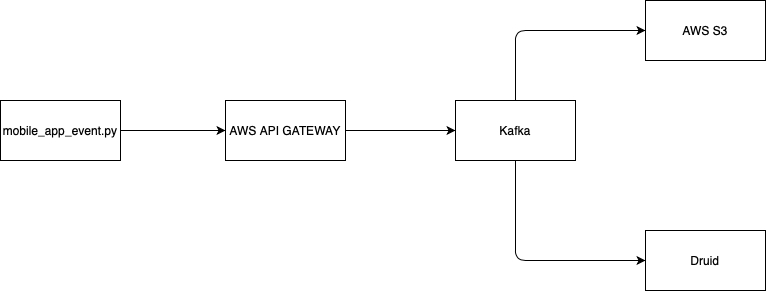

# 99.coDataEngineerChallenge

- event_ingestion directory contain a readme file(EVENT_INGESTION_README), explaining how the data pipeline is built to achieve high throughput, low latency requirement of the event ingestion API.
- event_storage directory contain a readme file(EVENT_STORAGE_README), explaining what tools could use for data lake. Compare and contrast some existing tools in the market and the factors on which, then decide on a particular one.
- event_querying directory contain a readme file(EVENT_QUERYING_README), explaining what tools could use for data warehouse. Compare and contrast some existing tools in the market and the factors on which, then decide on a particular one.

## High level overview

How would the near real-time nature analysis influence the data pipeline design?

Both stream and batch ingestion/processing have the same main goal; making sure that data ends up in the right form and right place. But how the data flows in the data pipeline is different and influence the data pipeline design. 
In batch ingestion/processing, raw data in the source are accumulated before an ETL job run. Interval of ETL job are often schedule by tools like airflow. For every ETL job, data to be ingestion/process are finite. This mean that Data Analyst can only query the events from the data warehouse hours or days later.
In stream ingestion/processing, raw data are ingest/process as soon as it arrives in the data source. No need for orchestration tools like airflow since it is ingesting raw data continuously.

Using the events data as a example, if we were to use batch ingestion/processing, data pipeline design would focus on higher throughput as compare to latency. With different focus, tools used to perform batch ingestion/processing would be different from a stream ingestion/processing. Common tools are Spark, Hadoop etc. While in stream ingestion/processing, data pipeline would focus on latency and throughput and tools used to achieve these are Kafka, Flink, etc. 
